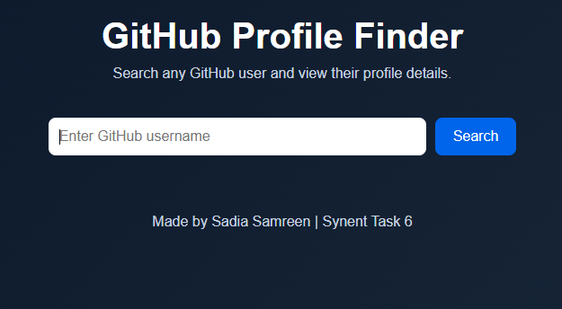
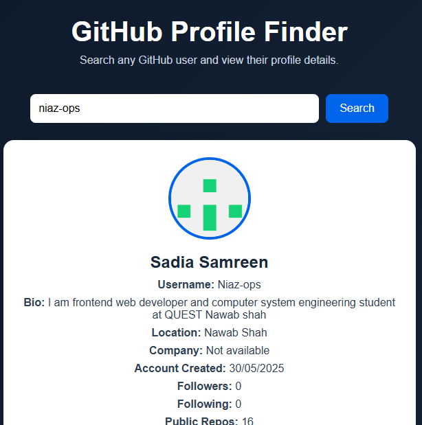
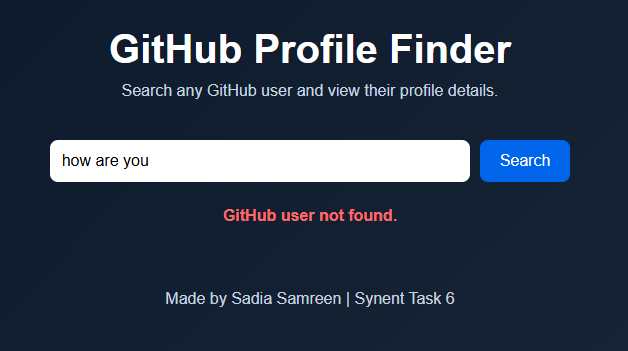

# synent-task6-githubprofilefinder-sadiasamreen

Synent Technologies Internship Task 6 - GitHub Profile Finder (API Integration Project)

A responsive web application that allows users to search any GitHub username and view detailed profile information using the GitHub REST API.

---

## 🚀 Features

- Search GitHub users by username
- Fetch real-time data using GitHub API
- Display GitHub profile image
- Display user's name and username
- Show user bio information
- Display location information
- Show followers count
- Show following count
- Display public repositories count
- Direct link to GitHub profile
- Loading indicator while fetching data
- Error handling for invalid usernames
- Responsive design for desktop and mobile devices

---

## 🛠️ Technologies Used

- HTML5
- CSS3
- JavaScript (ES6)
- GitHub REST API

---

## 🔗 API Used

This project uses GitHub REST API to fetch user profile information.

API Endpoint:

```
https://api.github.com/users/{username}
```

Example:

```
https://api.github.com/users/octocat
```

---

## 📂 Project Structure

```
synent-task6-githubprofilefinder-sadiasamreen/

│
├── index.html
├── style.css
├── script.js
├── README.md
│
└── images/
    ├── home.png
    ├── profile-result.png
    └── error.png
```

---

## ⚙️ How to Run the Project

1. Clone this repository:

```
git clone https://github.com/Niaz-ops/synent-task6-githubprofilefinder-sadiasamreen.git
```

2. Open the project folder.

3. Open `index.html` in your browser.

4. Enter any GitHub username and click the Search button.

---

## 📸 Application Preview

### Home Page




### GitHub Profile Result




### Error Handling



---

## 🎯 Learning Outcomes

Through this project, I learned:

- How to work with external APIs
- Using Fetch API in JavaScript
- Handling asynchronous operations with async/await
- Working with JSON data
- Implementing error handling
- Updating UI dynamically using JavaScript
- Creating responsive user interfaces

---

## 👩‍💻 Developer

**Sadia Samreen**

Computer Systems Engineering Student

Frontend Web Developer

---

## 📌 Internship Information

Developed for:

**Synent Technologies Internship Program**

Task:

**Task 6 - API Integration Project**